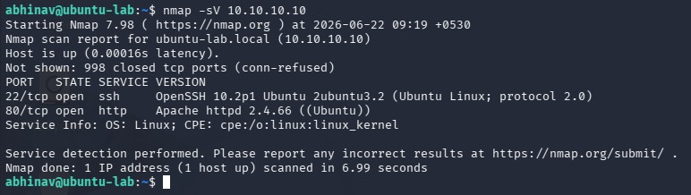
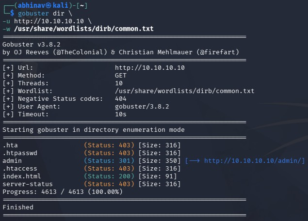
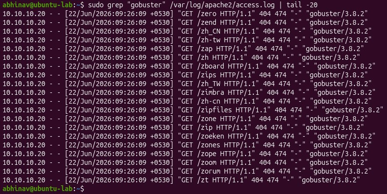
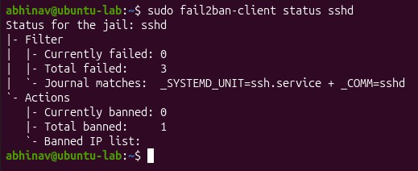
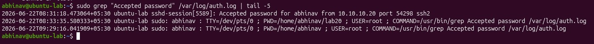
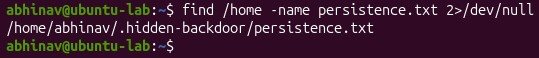
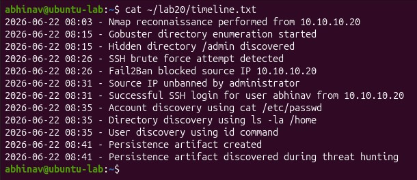

# Linux Detection Engineering Capstone

## Overview

This project demonstrates an end-to-end Detection Engineering and Threat Hunting investigation using a home lab environment.

The objective was to simulate attacker activity, generate telemetry, validate detections, investigate events, reconstruct an attack timeline, and map activity to MITRE ATT&CK techniques.

---

## Lab Environment

### Attacker

- Kali Linux
- IP: 10.10.10.20

### Target

- Ubuntu Linux
- Apache Web Server
- OpenSSH
- auditd
- Fail2Ban

---

## Attack Lifecycle

### Phase 1 – Reconnaissance

Attacker performed service discovery using Nmap.

Evidence:

- OpenSSH detected on port 22
- Apache HTTP detected on port 80

MITRE ATT&CK:

- T1046 – Network Service Discovery

---

### Phase 2 – Web Enumeration

Attacker performed directory enumeration using Gobuster.

Discovery:

- /admin

Evidence Source:

- Apache access.log

MITRE ATT&CK:

- T1083 – File and Directory Discovery

---

### Phase 3 – SSH Brute Force

Attacker attempted authentication using an invalid account.

Evidence:

- Failed password events in auth.log

Response:

- Fail2Ban automatically blocked the attacker IP

MITRE ATT&CK:

- T1110 – Brute Force

---

### Phase 4 – Valid Account Access

Attacker successfully authenticated using a valid account.

Evidence:

- Accepted password for user abhinav

MITRE ATT&CK:

- T1078 – Valid Accounts

---

### Phase 5 – Discovery

Commands executed:

- cat /etc/passwd
- ls -la /home
- id

MITRE ATT&CK:

- T1087 – Account Discovery
- T1033 – System Owner/User Discovery
- T1083 – File and Directory Discovery

---

### Phase 6 – Persistence Simulation

Artifact Created:

- /home/abhinav/.hidden-backdoor/persistence.txt

MITRE ATT&CK:

- T1547 – Persistence (Lab Simulation)

---

## Investigation Artifacts

Repository Files:

- timeline.txt
- findings.txt
- indicators.txt
- detections/detection-rules.md

---

## Skills Demonstrated

- Detection Engineering
- Threat Hunting
- Linux Security Monitoring
- auditd
- Apache Log Analysis
- Authentication Monitoring
- Fail2Ban
- Incident Investigation
- MITRE ATT&CK Mapping

---

## Evidence

### Nmap Reconnaissance

### Gobuster Enumeration

### Apache Log Evidence

### Fail2Ban Response

### Successful Login

### Persistence Discovery

### Attack Timeline

---

## Key Lessons Learned

- Detection rules must be validated against real telemetry.
- Log collection alone does not provide security value.
- Multiple log sources are required for effective investigations.
- Automated controls such as Fail2Ban can disrupt attacker activity.
- Threat hunting benefits from timeline reconstruction and ATT&CK mapping.
